# Pi-Project Fabian Kleine und Gian-Lucca Kaworsky

## Starten des Projekts
Das Repository liegt einmal unter /var/www/html/pi-project für das PHP Backend und einmal unter /home/it/pi-project/ um Python laufen zu lassen.

### Sensor Daten in die Datenbank laden

##### Virtual Enviroment
Zuerst muss man ein virtual Enviroment aufmachen mit `source python/.venv/bin/activate` um alle Dependencies für die Sensoren zu laden.
##### Virtual Enviroment Einrichten
Falls keine .venv Datei existiert muss erst mit `python3 -m venv python/.venv` das virtual Environment erstellt werden und wenn dependencies fehlen müssen diese im Virtual Enviroment mit `pip install -r python/requirements.txt` installiert werden.
##### Py Datei ausführen
Dann führt man mit `python3 python/main.py` die python datei aus, die die Daten von den Sensoren alle 5 Minuten in die Datenbank lädt

### Backend
Im Backend Ordner liegt ein PHP Projekt welches mit PDO eine Verbindung zur Datenbank aufbaut um eine APi für das Frontend zu bilden

### Frontend

In `frontend/src/config.ts` muss zunächst die IP-Adresse des Backends in `API_BASE_URL` eingetragen werden:

```typescript
// frontend/src/config.ts
export const API_BASE_URL = "http://172.16.111.34";
export const UPDATE_INTERVAL_MS = 5000;
```

Das Frontend lässt sich dann mit folgendem Befehl starten:

```
cd frontend
npm install
npx vite --host
```

Das Frontend ist dann unter `<IP-Adresse>:5173` aufrufbar.

## Web-Oberfläche

### Eigenentwicklung

Die folgenden Dateien stammen **nicht** von genutzten Librarys oder Ähnlichem und wurden eigenst entwickelt:

```
frontend/
    └── src/
        ├── components/
        │   ├── CurrentVocValues.vue
        │   ├── PersonTemperatureDiagramm.vue
        │   ├── RecentReadings.vue
        │   ├── TemperatureForecast.vue
        │   ├── TemperatureTrendDiagramm.vue
        ├── lib/
        │   ├── db.ts
        │   ├── regression.ts
        │   ├── utils.ts (nur formatISODateLocal)
        ├── types/
        │   └── index.ts
        ├── App.vue
        └── config.ts
```

### Screenshots

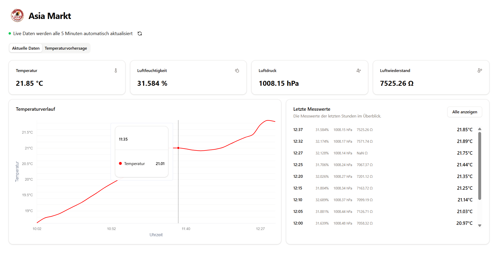

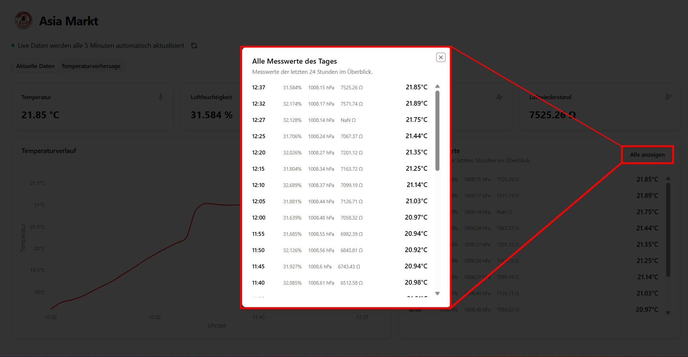

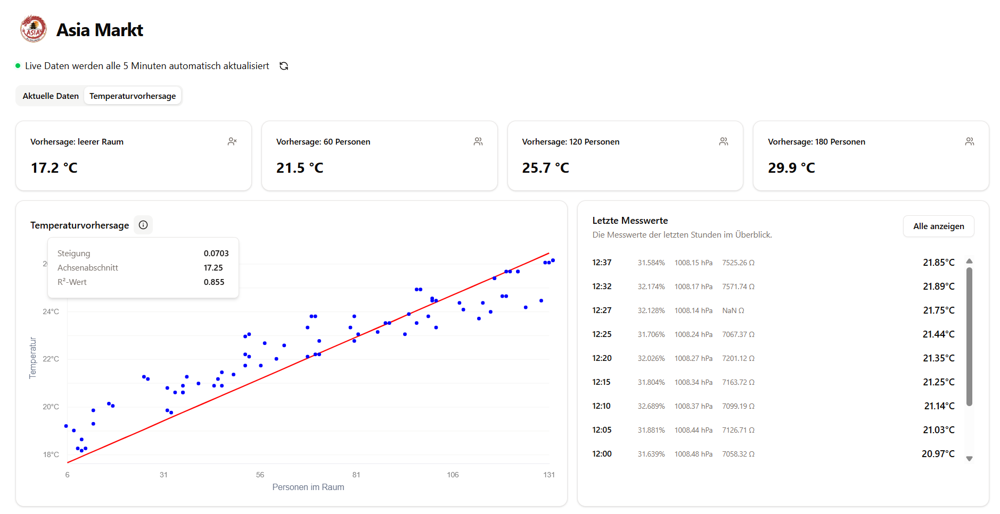

## Datenbankstruktur

### Radar Sensor

#### Struktur

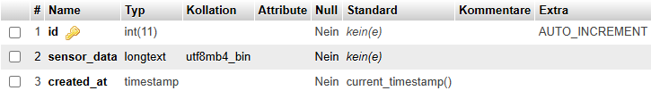

#### Beispiel Daten

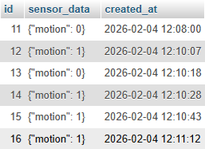

### VOC Sensor

#### Struktur

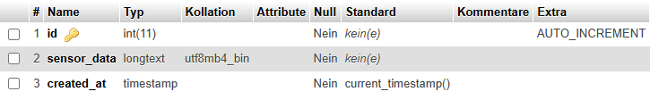

#### Beispiel Daten

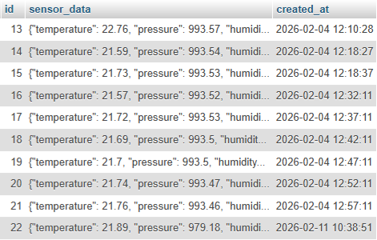

### Regression Trainings Daten

#### Struktur

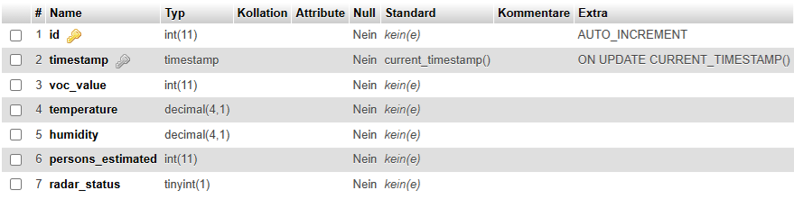

#### Beispiel Daten

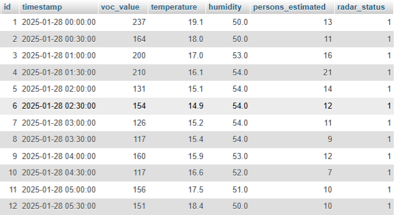

## Verkabelung beider Sensoren

### BME680 Sensor

VIN -> 3v3
GND -> GND
SCK -> SCL1
SDI -> SDA1

### RCWL-0516

VIN -> 3v3
CUT -> GPO22
GND -> GND

### Bilder der Schaltung

#### Komplette Schaltung
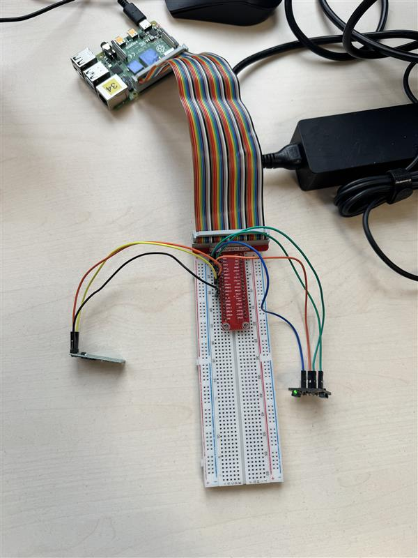

#### Board
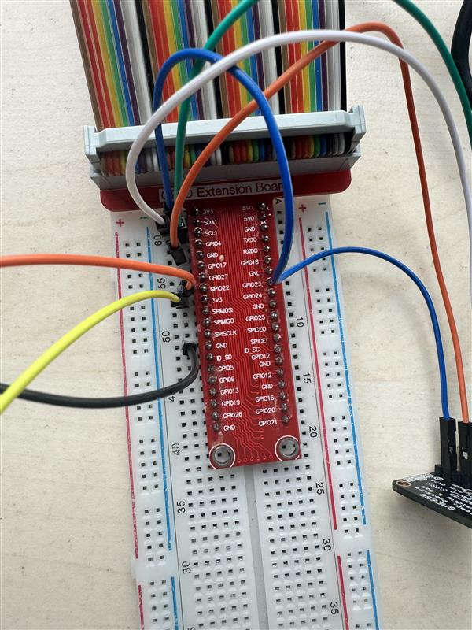
#### BME680
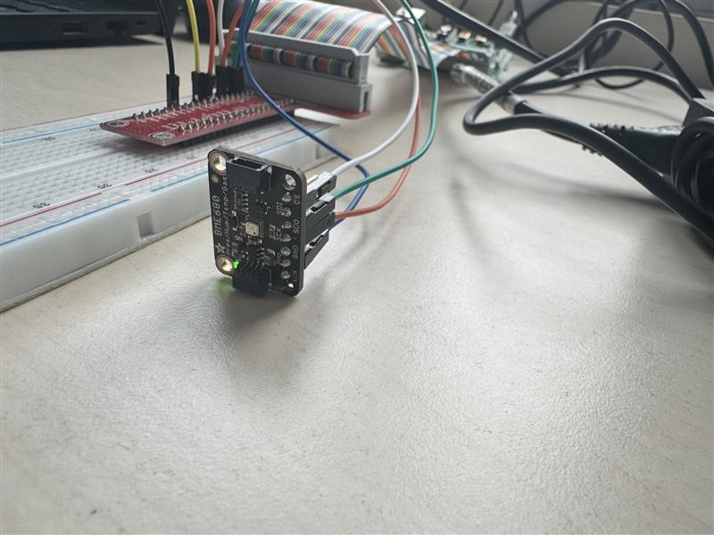

#### RCWL
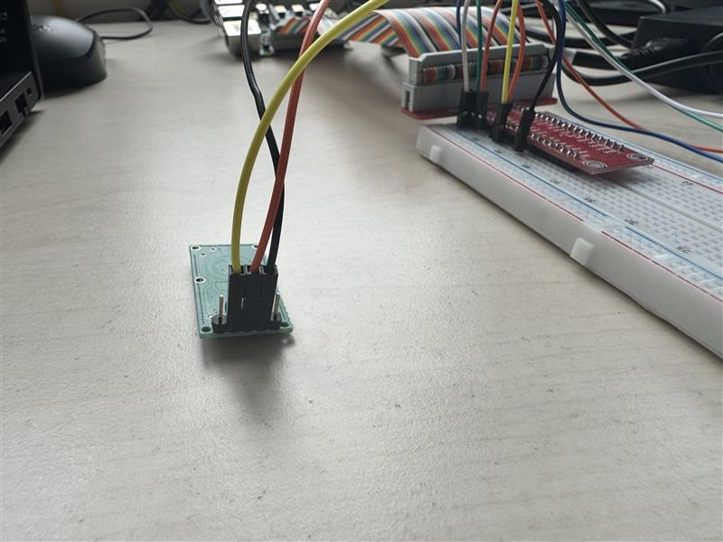

